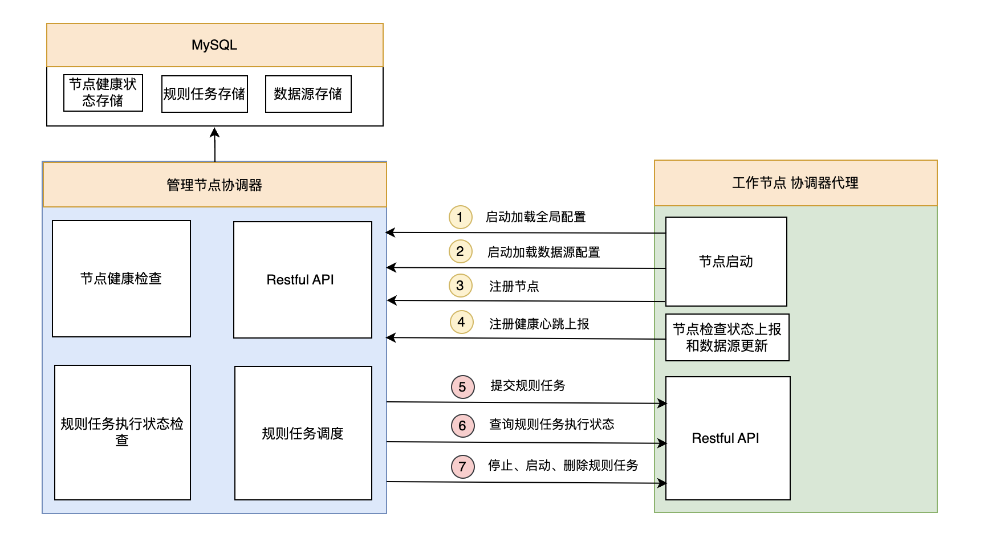
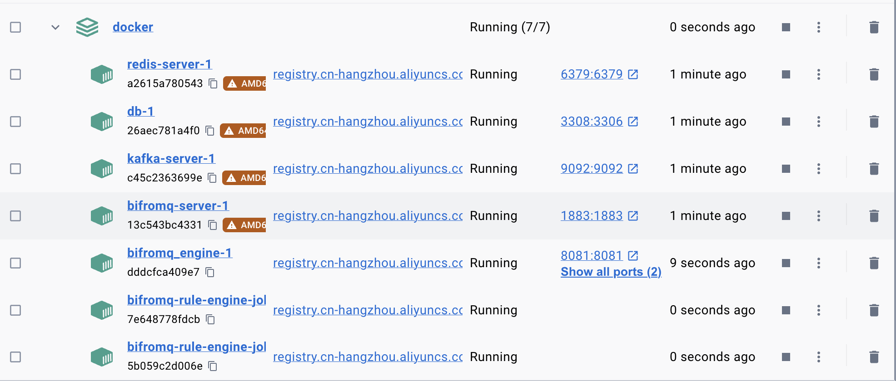
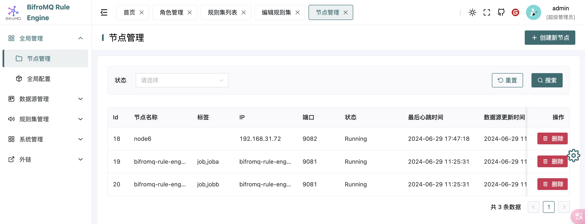
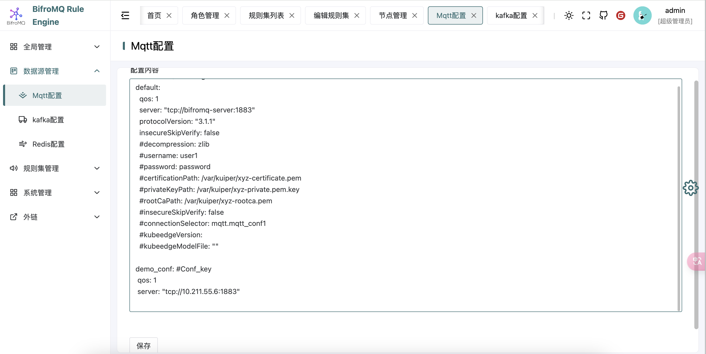
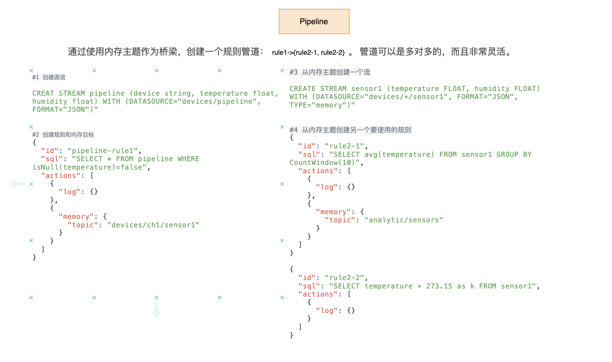

# 项目代码和文档

- 管理节点和控制台：
  - https://atomgit.com/haoyu/bifromq_engine
- ekuiper 二次开发代码分支
  - https://github.com/2456868764/ekuiper/tree/feat-engine
- PPT和文档
  - PPT https://atomgit.com/haoyu/bifromq_engine/blob/main/deploy/bifromq.pptx
  - PDF文档  https://atomgit.com/haoyu/bifromq_engine/blob/main/deploy/bifromq-rule-design.pdf

# 一、整体架构
Bifromq 规则引擎设计整体框架如下：


整体来看，整个框架设计实现一个可扩展、分布式的规则引擎，其中包含了数据存储、消息传递、规则处理和系统管理等多个组件。每个组件都有其特定的职责，并通过定义良好的接口和协议相互协作。其中主要组件如下：
- 管理节点：

负责管理和协调其他节点的中心节点，负责规则的分发、任务的调度监控、提供API接口。包括Restful API 和 协调器俩个子组件。

- 工作节点：

工作节点是从管理节点接收规则、执行规则、上报状态等服务实例，同时根据规则订阅Bifromq MQTT Broker上的消息，处理消息。包含协调器代理 和 规则执行器俩个子组件。

- 控制台：

提供了一个图形用户界面，允许管理员或用户配置数据源、规则、查看规则执行状态和处理结果等功能。

- MySQL：

作为持久化存储，用于存储用户和权限，工作节点状态、数据源、规则定义和执行状态等数据。

- Sources/Sinks:

支持Sources/Sinks 包括Bifromq、kafka、redis、memory。 提供规则处理的数据来源和规则处理结果输出存储。

# 二、协调器工作原理
协调器工作原理如下图：



协调器在这个系统中扮演着核心角色，类似于大脑，负责节点管理、任务调度、状态监控和通信协调。以下是协调器及其代理组件的详细工作流程：

协调器组件：
1. 节点健康检查协程：定期对工作节点进行健康检查，确保它们正常运行。不健康的节点将从调度队列中移除，以保证任务分配的高效性。
2. 规则任务执行状态检查协程：通过协调器代理的Restful API，定期检查工作节点上规则任务的执行状态，确保任务按照预期进行。
3. 规则任务调度协程：根据规则任务的定义和触发条件，智能地在适当的工作节点上调度任务执行。
4. Restful API协程：提供Restful API接口，实现与工作节点上的协调器代理的通信。主要负责下发全局配置和数据源配置、节点的注册与注销、节点健康状态的上报等。
   
协调器代理组件：
1. 节点启动：在节点启动时，通过协调器的Restful API获取全局启动配置和数据源配置，同时完成节点的注册，并启动健康状态上报和数据更新协程。
2. 健康状态上报和数据更新协程：负责将节点的健康状态上报给协调器。同时，如果管理节点上的数据源配置有更新，将同步更新工作节点的状态和数据源配置。
3. Restful API协程：提供Restful API接口，与协调器进行通信，负责提交规则任务、查询规则任务的执行状态，以及控制规则任务的启动、停止和删除。
   
通过这些组件和流程，协调器确保了系统的高效运行和灵活的任务管理，同时也提供了强大的监控和控制能力。
   
# 三、 规则设计

规则整体结构如下图：


   
规则集（RuleSet) 规则集能够定义复杂的事件处理逻辑，从数据的接收、处理到最终的响应，形成一个完整的数据处理流程。一个规则集包括 多条Stream（流） 和 多条Rule（规则）组成。

## Stream（流）

流定义需要指定其数据源类型以定义与外部资源的连接方式。数据源作为流使用时，源必须为无界的。在规则中，流的行为类似事件触发器。每个事件都会触发规则的一次计算。

流定义如下：

```sql
   CREATE STREAM
   stream_name
   ( column_name <data_type> [ ,...n ] )
   WITH ( property_name = expression [, ...] );

```

流定义是一个 SQL 语句。它由两部分组成。

1. 流的模式定义。其语法与 SQL 表定义相同。这里的模式是可选的。如果它是空的，则流是无模式的。
2. 在 WITH 子句中定义连接器类型和行为的属性，如序列化格式。

```sql
CREATE STREAM demo (
        USERID BIGINT,
        FIRST_NAME STRING,
        LAST_NAME STRING,
        NICKNAMES ARRAY(STRING),
        Gender BOOLEAN,
        ADDRESS STRUCT(STREET_NAME STRING, NUMBER BIGINT),
    ) WITH (DATASOURCE="test/", FORMAT="JSON", KEY="USERID", CONF_KEY="demo");

```

```sql
create stream demo (device string, temperature float, humidity float) WITH (FORMAT="JSON", DATASOURCE="devices/+/messages")

```


## Rule(规则）
每条规则都代表了运行的一项计算工作。它定义了连续流数据源作为输入，计算逻辑和结果 sink 作为输出。

### 1. SQL 规则
SQL 规则 通过指定 sql 和 actions 属性，sql 定义了针对预定义流运行的 SQL 查询，这将转换数据。然后，输出的数据可以通过 action 路由到多个位置。

```json
{
   "id": "rule1",
   "sql": "select * from demo where temperature > 10",
   "actions": [
     {
       "log": {}
     },
     {
       "mqtt": {
         "server": "tcp://bifromq-server:1883",
         "topic": "devices/allmessages"
       }
     },
     {
       "kafka":{
         "brokers": "kafka-server:9092",
         "topic": "allmessages",
         "saslAuthType": "none"
       }
     }
   ]
}
```  

### 2. 图规则
   
graph 属性是有向无环图的 JSON 表述。它由 nodes 和 topo 组成，分别定义了图中的节点和它们的边。下面是一个由图形定义的最简单的规则。它定义了3个节点：demo，humidityFilter 和 mqttOut。这个图是线性的，即demo->humidityFilter->mqttOut。该规则将从mqtt(demo)读取，通过湿度过滤(humidityFilter)并汇入mqtt(mqttOut)。

```json
{
  "id": "rule1",
  "name": "Test Condition",
  "graph": {
    "nodes": {
      "demo": {
        "type": "source",
        "nodeType": "mqtt",
        "props": {
          "datasource": "devices/+/messages"
        }
      },
      "humidityFilter": {
        "type": "operator",
        "nodeType": "filter",
        "props": {
          "expr": "humidity > 30"
        }
      },
      "mqttout": {
        "type": "sink",
        "nodeType": "mqtt",
        "props": {
          "server": "tcp://bifromq-server:1883",
          "topic": "devices/result"
        }
      }
    },
    "topo": {
      "sources": ["demo"],
      "edges": {
        "demo": ["humidityFilter"],
        "humidityFilter": ["mqttout"]
      }
    }
  }
}

```

# 四、函数 Function

支持函数如下图：


# 五、数据连接

支持 Source 和 Sink 如下图：


# 六、执行器

执行器是基于开源 eKuiper 二次开发进行构建，eKuiper  是 Golang 实现的轻量级物联网边缘分析、流式处理开源软件，可以运行在各类资源受限的边缘设备上。eKuiper 的规则引擎是基于 SQL 或基于图形（类似于 Node-RED）的规则。


eKuiper 通过规则/SQL 解析器或图规则解析器将解析、规划和优化规则，使其成为一系列算子的流程，算子可以利用流式运行时和状态存储。算子之间通过 Go 通道进行异步通信。
受益于 Go 的并发模型，规则运行时可以做到：

- 以异步和非阻塞的方式进行通信。
- 充分利用多核计算。
- 算子层可伸缩。
- 规则之间相互隔离。

在 eKuiper 中，计算工作以规则的形式呈现。规则以流的数据源为输入，通过 SQL 定义计算逻辑，将结果输出到动作/sink 中。
规则定义提交后，它将持续运行。它将不断从源获取数据，根据 SQL 逻辑进行计算，并根据结果触发行动。核心计算组件包括 Rule、Source、Sink。

# 七、部署

在项目 deploy/docker 目录下有个 docker-compose.yaml 文件，内容如下：

```yaml
version: '3.9'
networks:
  bifromq-net:
    external: false
services:
  db:
    image: registry.cn-hangzhou.aliyuncs.com/2456868764/mysql:5.7  # 使用MySQL 5.7镜像，你可以选择其他版本
    networks:
      - bifromq-net
    ports:
      - "3308:3306/tcp"
    volumes:
      - ./data/mysql:/var/lib/mysql  # 将数据库文件存储在卷中，以便持久化存储
      - ./data/init:/docker-entrypoint-initdb.d
    restart: always  # 容器退出时总是重启
    environment:
      MYSQL_ROOT_PASSWORD: 123456  # 设置root用户的密码
      MYSQL_DATABASE: engine  # 创建并初始化一个数据库
      MYSQL_USER: dev  # 创建一个新用户
      MYSQL_PASSWORD: 123456  # 设置新用户的密码
  bifromq_engine:
    image: registry.cn-hangzhou.aliyuncs.com/2456868764/bifromq_engine:v1.0.2
    command: ["serve", "--api-port=8090","--coordinator-port=8081","--dns=root:123456@tcp(db:3306)/engine?charset=utf8mb4&parseTime=True&loc=Local"]
    environment:
      - JWT_SIGNING_KEY=bifromq
    networks:
      - bifromq-net
    ports:
      - "8090:8090/tcp"
      - "8081:8081/tcp"
    volumes:
      - ./data/engine:/data
    restart: always
    depends_on:
      - db
  bifromq-server:
    image: registry.cn-hangzhou.aliyuncs.com/2456868764/bifromq:latest
    networks:
      - bifromq-net
    ports:
      - "1883:1883/tcp"
    restart: always
  redis-server:
    image: registry.cn-hangzhou.aliyuncs.com/2456868764/redis:latest  # 使用最新版本的Redis镜像
    environment:
      - ALLOW_EMPTY_PASSWORD=yes
    networks:
      - bifromq-net
    volumes:
      - ./data/redis:/bitnami/redis  # 持久化Redis数据
    ports:
      - "6379:6379"  # 将容器的6379端口映射到宿主机的6379端口
    restart: always  # 容器退出时总是重启
  kafka-server:
    image: registry.cn-hangzhou.aliyuncs.com/2456868764/kafka:latest
    networks:
      - bifromq-net
    volumes:
      - ./data/kafka:/bitnami/kafka
    ports:
      - '9092:9092'
    environment:
      - KAFKA_CFG_NODE_ID=0
      - KAFKA_CFG_PROCESS_ROLES=controller,broker
      - KAFKA_CFG_LISTENERS=PLAINTEXT://:9092,CONTROLLER://:9093
      - KAFKA_CFG_LISTENER_SECURITY_PROTOCOL_MAP=CONTROLLER:PLAINTEXT,PLAINTEXT:PLAINTEXT
      - KAFKA_CFG_CONTROLLER_QUORUM_VOTERS=0@kafka-server:9093
      - KAFKA_CFG_CONTROLLER_LISTENER_NAMES=CONTROLLER
  bifromq-rule-engine-joba:
    image: registry.cn-hangzhou.aliyuncs.com/2456868764/ekuiperd:v1.0.0
    environment:
      - NODE_IP=bifromq-rule-engine-joba
      - NODE_POR=9081
      - NODE_NAME=bifromq-rule-engine-joba
      - NODE_TAG=job,joba
      - COORDINATOR_HOST=bifromq_engine:8081
    networks:
      - bifromq-net
    restart: always
    depends_on:
      - db
      - bifromq_engine
  bifromq-rule-engine-jobb:
    image: registry.cn-hangzhou.aliyuncs.com/2456868764/ekuiperd:v1.0.0
    environment:
      - NODE_IP=bifromq-rule-engine-jobb
      - NODE_POR=9081
      - NODE_NAME=bifromq-rule-engine-jobb
      - NODE_TAG=job,jobb
      - COORDINATOR_HOST=bifromq_engine:8081
    networks:
      - bifromq-net
    restart: always
    depends_on:
      - db
      - bifromq_engine
```

启动命令:

```shell
docker compose up -d
```

启动 包括 数据库mysql db, 管理节点 bifromq engine, 控制台 bifromq ui, bifromq broker server, redis server , kafka server, 工作节点 A ：rule engine job a ,工作节点 B： rule engine job b 容器。



访问 http://127.0.0.1/8090  进入 bifromq 控制台管理界面， 账号和密码 admin/admin。


# 七、控制台






# 八、案例
## 1. Demo Sinks

```shell
#1 创建源流

CREAT STREAM demo (device string, temperature float, humidity float) WITH (FORMAT="JSON", DATASOURCE="devices/+/messages")

#2 创建规则和目标
{
  "id": "demo",
  "sql": "select * from demo where temperature > 10",
  "actions": [
    {
      "log": {}
    },
    {
      "mqtt": {
        "server": "tcp://bifromq-server:1883",
        "topic": "devices/allmessages"
      }
    },
    {
      "kafka":{
        "brokers": "kafka-server:9092",
        "topic": "test",
        "saslAuthType": "none"
      }
    }
  ]
}
```
测试结果：


## 2. 规则管道 - pipeline

以通过将先前规则的结果导入后续规则来形成规则管道。 这可以通过使用中间存储或 MQ（例如 mqtt 消息服务器）来实现。 通过同时使用 内存源 和 目标，我们可以创建没有外部依赖的规则管道。



```shell
#1 创建源流

CREAT STREAM pipeline (device string, temperature float, humidity float) WITH (DATASOURCE="devices/pipeline", FORMAT="JSON")"


#2 创建规则和内存目标
{
  "id": "pipeline-rule1",
  "sql": "SELECT * FROM pipeline WHERE isNull(temperature)=false",
  "actions": [
    {
      "log": {}
    },
    {
      "memory": {
        "topic": "devices/ch1/sensor1"
      }
    }
  ]
}
#3 从内存主题创建一个流

CREATE STREAM sensor1 (temperature FLOAT, humidity FLOAT) 
WITH (DATASOURCE="devices/+/sensor1", FORMAT="JSON", TYPE="memory")

#4 从内存主题创建另一个要使用的规则
{
  "id": "rule2-1",
  "sql": "SELECT avg(temperature) FROM sensor1 GROUP BY CountWindow(10)",
  "actions": [
    {
      "log": {}
    },
    {
      "memory": {
        "topic": "analytic/sensors"
      }
    }
  ]
}

{
  "id": "rule2-2",
  "sql": "SELECT temperature + 273.15 as k FROM sensor1",
  "actions": [
    {
      "log": {}
    }
  ]
}
```

测试结果：

```shell
time="2024-06-29T09:45:52+08:00" level=info msg="sink result for rule pipeline-rule1: [{\"device\":\"sensor2\",\"humidity\":11.12,\"temperature\":12.1}]" file="sink/log_sink.go:32" rule=pipeline-rule1
time="2024-06-29T09:45:52+08:00" level=info msg="sink result for rule rule2-2: [{\"k\":285.25}]" file="sink/log_sink.go:32" rule=rule2-2
time="2024-06-29T09:45:53+08:00" level=info msg="sink result for rule pipeline-rule1: [{\"device\":\"sensor2\",\"humidity\":11.12,\"temperature\":12.1}]" file="sink/log_sink.go:32" rule=pipeline-rule1
time="2024-06-29T09:45:53+08:00" level=info msg="sink result for rule pipeline-rule1: [{\"device\":\"sensor2\",\"humidity\":11.12,\"temperature\":12.1}]" file="sink/log_sink.go:32" rule=pipeline-rule1
time="2024-06-29T09:45:53+08:00" level=info msg="sink result for rule rule2-2: [{\"k\":285.25}]" file="sink/log_sink.go:32" rule=rule2-2
time="2024-06-29T09:45:53+08:00" level=info msg="sink result for rule rule2-2: [{\"k\":285.25}]" file="sink/log_sink.go:32" rule=rule2-2
time="2024-06-29T09:45:53+08:00" level=info msg="sink result for rule rule2-2: [{\"k\":285.25}]" file="sink/log_sink.go:32" rule=rule2-2
time="2024-06-29T09:45:53+08:00" level=info msg="sink result for rule pipeline-rule1: [{\"device\":\"sensor2\",\"humidity\":11.12,\"temperature\":12.1}]" file="sink/log_sink.go:32" rule=pipeline-rule1

```


# 九 项目构建

## prebuild

build 项目之前，需要下载项目 ekuiper 特定分支到本地 external 目录
执行 make prebuild

```shell
make prebuild
```


# Reference
- [Alarm based on multi cycle conditions](https://github.com/lf-edge/ekuiper/discussions/1677)
- [eKuiper forum](https://askemq.com/c/ekuiper/6)
- [Datab](https://www.cnblogs.com/databend/p/17772981.html)
- [使用 EMQX 和 eKuiper 进行 MQTT 流处理：快速教程](https://cloud.tencent.com/developer/article/2302298)
- [Flow 编排](https://cloud.baidu.com/article/295417)
- [eKuiper 1.8.0 发布](https://juejin.cn/post/7205487413350711352)
- [vue naive admin](https://github.com/zclzone/vue-naive-admin)


